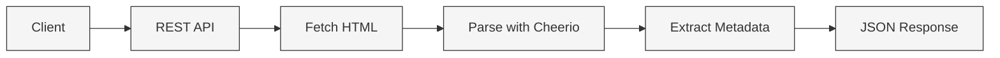

🌐 Website Metadata API REST
============================

**A fast, lightweight REST API to extract essential metadata from any public website**

     

* * *

✨ Overview
----------

**Website Metadata API REST** is a simple and efficient RESTful API built with **Node.js** and **Express**.  
It allows developers to extract useful metadata from any public website using a single HTTP request.

This API is ideal for **SEO tools**, **link previews**, **dashboards**, and **automation workflows**.

* * *

🚀 Features
-----------

✅ Extract website metadata  
✅ Clean JSON responses  
✅ URL validation  
✅ Rate limiting (anti-abuse)  
✅ Lightweight & easy to extend

### Extracted data

*   🏷️ Page title
    
*   📝 Meta description
    
*   🌐 Language
    
*   🖼️ Open Graph image (`og:image`)
    
*   ⭐ Favicon
    

* * *

🧠 How It Works
---------------

    

  

  

* * *

📡 API Endpoints
----------------

### 🟢 Health Check

    GET /health
    

    {
      "ok": true
    }
    

* * *

### 🔍 Metadata Extraction

    GET /metadata?url=https://example.com
    

#### Query Parameters

Parameter

Type

Required

Description

`url`

string

✅

Website URL to analyze

* * *

📦 Example Response
-------------------

    {
      "url": "https://example.com",
      "status": 200,
      "title": "Example Domain",
      "description": null,
      "language": "en",
      "ogImage": null,
      "favicon": null
    }
    

* * *

🛡️ Security & Limits
---------------------

### 🔒 Rate Limiting

*   **60 requests per minute per IP**
    
*   Protects the API from abuse
    

    Client → Rate Limiter → API
            ├─ Allowed → 200 OK
            └─ Blocked → 429 Too Many Requests
    

* * *

<h2 align="center">⚙️ Tech Stack</h2>

<table align="center" width="100%">
  <thead>
    <tr>
      <th align="left">Technology</th>
      <th align="left">Role</th>
    </tr>
  </thead>
  <tbody>
    <tr>
      <td>
         
        <strong>Node.js</strong>
      </td>
      <td>Runtime</td>
    </tr>
    <tr>
      <td>
         
        <strong>Express</strong>
      </td>
      <td>REST API framework</td>
    </tr>
    <tr>
      <td>
         
        <strong>Cheerio</strong>
      </td>
      <td>HTML parsing</td>
    </tr>
    <tr>
      <td>
         
        <strong>node-fetch</strong>
      </td>
      <td>HTTP requests</td>
    </tr>
    <tr>
      <td>
         
        <strong>Helmet</strong>
      </td>
      <td>Security headers</td>
    </tr>
    <tr>
      <td>
         
        <strong>Morgan</strong>
      </td>
      <td>Logging</td>
    </tr>
    <tr>
      <td>
         
        <strong>express-rate-limit</strong>
      </td>
      <td>Rate limiting</td>
    </tr>
  </tbody>
</table>

* * *

🛠️ Installation
----------------

### 1️⃣ Clone the repository

    git clone https://github.com/Ayoub-glitsh/website-metadata-api-rest.git
    cd website-metadata-api-rest
    

### 2️⃣ Install dependencies

    npm install
    

### 3️⃣ Start the server

    npm start
    

📍 Server runs on:

    http://localhost:3000
    

* * *

🧪 Quick Test
-------------

    curl "http://localhost:3000/metadata?url=https://example.com"
    

* * *

💡 Use Cases
------------

*   🔎 SEO analysis tools
    
*   🔗 Link preview generation
    
*   📊 Dashboards & analytics
    
*   🧩 CMS integrations
    
*   🤖 Automation & scraping pipelines
    

* * *

🗺️ Roadmap
-----------

*    API key authentication
    
*    Free / Pro usage quotas
    
*    Response caching
    
*    `/company` enrichment endpoint
    
*    Monetization & API marketplace release
    

* * *

📄 License
----------

This project is licensed under the **MIT License**.

* * *

